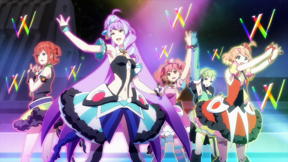

# マクロスΔ 超时空要塞Δ Makurosu Deruta

 

***插图来源: [マクロスΔ 官方网站](https://macross.jp/delta)***

## 字幕信息

|项目|信息|
|-|-|
|源字幕制作者(组)|幻之(x诸神xDHR)字幕组 & BiliBili 个人翻译|
|集数|SP 01-09 (09不完整)|
|语言|简体中文|
|时间轴匹配|BD版(VCB-Studio)|
|类型|手抄, 非字幕组|
|字幕组手抄 & 分享许可|幻之/诸神未获取, DHR & BiliBili 个人译者已获取, 仅供学习交流|

## 说明

- 参考 [超时空要塞Δ Wiki (简中)](https://zh.wikipedia.org/wiki/%E8%B6%85%E6%99%82%E7%A9%BA%E8%A6%81%E5%A1%9E%CE%94), 修改源字幕部分用语
- SP 09 前半部分暂无字幕, 等待熟肉补全
